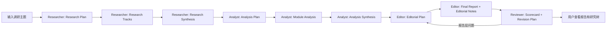

# Scout PRD

**Version**: v5.0  
**Date**: 2026-05-28  
**Status**: Architecture refresh for competition MVP  
**Primary reference**: `PRODUCT_DEFINITION.md`

---

## 1. Product Overview

Scout 是一个面向产品经理、创业团队、战略/投研团队的 **AI 竞品分析工作台**。用户输入一个产品、赛道或调研方向后，Scout 通过多 Agent 研究树生成一份可交付的 **竞品调研报告 / Competitive Analysis Report**。

Scout 的核心交付不是单纯生成文本，而是完整保留研究过程：

- 研究规划
- 搜索策略
- 多研究线资料
- 多分析模块文章
- 最终报告
- 审稿评分
- 修订计划
- 证据链和来源

产品主张：

> 结论先行，证据可追溯；报告可读，过程可审计。

---

## 2. Target Users

| 用户 | 关心的问题 | Scout 价值 |
|---|---|---|
| 产品经理 / 创业团队 | 这个需求真不真？竞品怎么打？机会在哪里？ | 给出问题导向的竞品调研报告和行动建议 |
| 战略 / 投研团队 | 市场是否值得进入？玩家如何分层？壁垒是什么？ | 输出市场、竞争格局、风险和战略选项 |
| 比赛评委 / 架构师 | Agent 是否真有分工、可观测、可恢复、可复用？ | 展示 LangGraph 主流程、研究树、artifact、审稿机制 |
| 开发/维护者 | 出错在哪里？如何复现？如何局部返修？ | Run events、artifact tree、review scorecard、revision plan |

---

## 3. Product Goals

| ID | Goal | Acceptance |
|---|---|---|
| G1 | 生成一份完整竞品调研报告 | 报告包含一页结论、Answer Map、市场、用户、竞品、矩阵、机会、风险、证据附录 |
| G2 | 展示可审计研究过程 | 前端可查看 Researcher/Analyst/Editor/Reviewer 的 artifacts |
| G3 | 支持树状研究结构 | 主节点串行，节点内部产物以 tracks/modules 展示 |
| G4 | 体现真实 Agent planning | Researcher 先输出 research_plan，Analyst 先输出 analysis_plan |
| G5 | 避免 token 浪费 | Reviewer 默认不自动回退整链路，只生成修订计划；P0 支持 Editor 重生成 |
| G6 | 保持比赛可演示性 | Mock data 只替代外部采集；Agent 推理必须调用真实 LLM |
| G7 | 中英结合呈现 | 前端中文主导、英文辅助；报告正文中文，术语可中英并列 |

---

## 4. Non-Goals

| Non-goal | Reason |
|---|---|
| 不做通用搜索引擎 | P0 重点是研究系统和报告质量，不是爬虫规模 |
| 不做全自动无限回退 | 会导致成本不可控，且不符合成熟研究流程 |
| 不做多租户/权限系统 | 与比赛主线无关 |
| 不做 PDF 高保真排版 | Markdown 可复制到飞书是第一优先级 |
| 不让 JSON 成为用户主界面 | JSON 只做索引和校验，用户看 Markdown |

---

## 5. Core User Flow



说明：

- 主流程串行：Researcher -> Analyst -> Editor -> Reviewer。
- 每个主节点内部可以产生多份子 artifact。
- Reviewer 默认只生成修订计划，不自动回退。
- P0 可支持仅重跑 Editor。

---

## 6. Report Requirements

最终报告文件：`editor/final_report.md`

展示名：

- 竞品调研报告
- Competitive Analysis Report

默认结构：

1. 一页结论
2. 核心问题与当前答案 / Answer Map
3. 研究范围与方法
4. 市场与时机
5. 用户与需求真实性
6. 竞争格局与玩家分层
7. 核心竞品深拆
8. 能力/技术/商业模式对比矩阵
9. 机会点与战略选项
10. 风险、未知数与下一步验证
11. 附录：Evidence Index / Source Index / Analyst Module Links / Reviewer Scorecard

报告质量要求：

- 忙的人 1 分钟能读出判断。
- 认真看的人 20 分钟能读到深度。
- 质疑的人 1 小时能追到证据。

---

## 7. Artifact Tree Requirements

P0 运行完成后，应至少生成以下 artifact tree。部分子节点可以先由单一 Agent 内部模拟，后续物理拆成并行子 Agent。

```text
runtime/artifacts/{task_id}/
  researcher/
    research_plan.md
    tracks/
      market_research.md
      user_research.md
      competitor_research.md
      product_research.md
      tech_research.md
      business_research.md
      risk_research.md
    research_synthesis.md
    index.json

  analyst/
    analysis_plan.md
    modules/
      market_analysis.md
      user_analysis.md
      competitor_landscape.md
      product_feature_analysis.md
      tech_analysis.md
      business_model_analysis.md
      risk_analysis.md
    analysis_synthesis.md
    index.json

  editor/
    editorial_plan.md
    final_report.md
    editorial_notes.md
    index.json

  reviewer/
    review_scorecard.md
    revision_plan.md
    index.json
```

### 7.1 Markdown First

Markdown 是主产物，给用户、下游 Agent 和 Reviewer 阅读。

### 7.2 JSON Index

JSON 只做：

- 前端树导航。
- API response。
- 状态、路径、依赖、置信度索引。
- Schema 校验和测试。

### 7.3 No Shared Concurrent Writes

并行子 Agent 不允许写同一个 Markdown。每个子 Agent 写自己的 artifact，父节点或 orchestrator 负责汇总。

---

## 8. Agent Requirements

### 8.1 Researcher

**角色**：研究规划 + 信息采集 + 证据结构化。

P0 requirements:

| ID | Requirement | Acceptance |
|---|---|---|
| R-001 | 生成 `research_plan.md` | 包含 Problem Space Map、Search Playbook、Sub-agent Assignment |
| R-002 | 生成研究线产物 | 至少 market/user/competitor 三条核心研究线；AI demo 增加 product/tech/business/risk |
| R-003 | 生成 evidence/source | 每条 evidence 绑定 source_id、product、dimension、confidence |
| R-004 | 生成 `research_synthesis.md` | 包含研究地图、资料综述、证据库说明、coverage gaps |
| R-005 | 处理失败和降级 | 搜不到/网页失败/资料弱时标注 source_gap，不编造 |

Researcher 不能输出战略结论或最终建议。

### 8.2 Analyst

**角色**：分析编排者 + 模块分析作者。

P0 requirements:

| ID | Requirement | Acceptance |
|---|---|---|
| A-001 | 生成 `analysis_plan.md` | 基于实际证据质量决定分析模块和强弱判断 |
| A-002 | 生成模块分析文章 | 每个模块是完整 Markdown 文章，包含结构化 Claim Pack |
| A-003 | 生成竞品分层 | 从需求域、广义替代、相邻品类、垂类、直接竞品、潜在进入者组织 |
| A-004 | 生成核心判断 | 每条判断包含 confidence、supporting_modules、evidence_refs、uncertainty |
| A-005 | 生成 `analysis_synthesis.md` | 汇总模块、提炼核心判断、给 Editor 组稿建议 |

Analyst 不负责搜索新资料，不写最终报告。

### 8.3 Editor

**角色**：主编 / Report Editor-in-Chief。

P0 requirements:

| ID | Requirement | Acceptance |
|---|---|---|
| E-001 | 生成 `editorial_plan.md` | 定义报告主线、章节顺序、核心观点处理策略 |
| E-002 | 生成 `final_report.md` | 符合报告结构，中文正文，中英辅助标题 |
| E-003 | 生成 `editorial_notes.md` | 记录哪些判断被提升、合并、降级、删除及原因 |
| E-004 | 支持报告层重生成 | 用户可基于现有 analysis 重新生成 final report |
| E-005 | 不新增无依据判断 | 新综合观点必须来自多个 Analyst module |

### 8.4 Reviewer

**角色**：虚拟审稿委员会。

P0 requirements:

| ID | Requirement | Acceptance |
|---|---|---|
| V-001 | 生成 `review_scorecard.md` | 按 7 个质量维度打分 |
| V-002 | 生成 `revision_plan.md` | 精确到 target_agent、target_artifact、rerun_scope、requires_new_research |
| V-003 | 支持 verdict | pass / revise / accept_with_limitation |
| V-004 | 不默认自动回退 | 默认只输出修订计划；报告层问题可建议重跑 Editor |
| V-005 | 模拟 committee | Evidence/Product/Strategy/Editorial/Risk/Originality 六个视角 |

---

## 9. Frontend Requirements

### 9.1 Language

前端中文主导、英文辅助。不做完整语言切换。

示例：

- 新建调研 / New Research
- 研究树 / Research Tree
- 研究线 / Research Tracks
- 分析模块 / Analysis Modules
- 最终报告 / Final Report
- 审稿评分 / Review Scorecard

### 9.2 Workbench

Workbench 必须展示：

- 四个主节点状态。
- 主节点内部 artifact tree。
- 每份 Markdown artifact 可打开。
- 最终报告优先展示。
- Evidence ID 可跳转到证据。
- Reviewer scorecard 和 revision plan 单独展示。
- 如果 Reviewer 建议报告层返修，显示 Regenerate Report。

### 9.3 Demo Priority

第一屏不展示技术解释。用户看到的是调研工作台和报告能力；技术可审计性通过 research tree 和 artifacts 体现。

---

## 10. Backend / API Requirements

### 10.1 Task API

```text
POST /api/tasks
GET /api/tasks
GET /api/tasks/{task_id}
POST /api/tasks/{task_id}/run
POST /api/tasks/{task_id}/regenerate-report
```

### 10.2 Artifact API

```text
GET /api/tasks/{task_id}/artifacts
GET /api/tasks/{task_id}/artifacts/{artifact_id}
GET /api/tasks/{task_id}/report
GET /api/tasks/{task_id}/review
```

### 10.3 Observability API

```text
GET /api/tasks/{task_id}/events
GET /api/tasks/{task_id}/summary
GET /api/tasks/{task_id}/traces
```

---

## 11. Observability and Logging

每次运行必须记录：

- task_id
- run_id
- current code branch/commit if available
- data_pack
- schema_pack
- LLM provider/model/endpoint alias
- fallback usage
- artifact refs
- reviewer verdict

Required events:

- TASK_CREATED
- RUN_STARTED
- NODE_STARTED
- ARTIFACT_SAVED
- NODE_SUCCEEDED
- NODE_FAILED
- FALLBACK_USED
- REVIEW_ISSUE
- REVIEW_DECIDED
- REPORT_REGENERATED
- RUN_COMPLETED
- RUN_FAILED

---

## 12. Tech Stack

| Layer | Stack |
|---|---|
| Frontend | Vite + React + TypeScript |
| Backend | Python + FastAPI |
| Agent orchestration | LangChain + LangGraph |
| LLM provider | Doubao via OpenAI-compatible adapter |
| Validation | Pydantic |
| Storage | SQLite + Markdown artifacts + JSON index |
| Observability | LangSmith optional + local trace mirror |
| Data pack | Mock-first collection; real LLM reasoning |

---

## 13. Milestones

### Phase 1: Definition and Artifact Contract

- `PRODUCT_DEFINITION.md` frozen.
- Artifact tree contract defined.
- Agent names updated: Researcher / Analyst / Editor / Reviewer.
- Markdown templates defined for plan/track/module/synthesis/report/review.

### Phase 2: Core Runtime

- Main LangGraph flow runs: Researcher -> Analyst -> Editor -> Reviewer.
- Each node writes Markdown artifacts and JSON index.
- Reviewer outputs scorecard/revision plan without automatic full rerun.
- Existing demo data runs end to end.

### Phase 3: Product Workbench

- Frontend shows research tree.
- Final report is primary view.
- Users can open every intermediate Markdown.
- Reviewer scorecard and revision plan are visible.
- Editor regeneration works for report-level issues.

---

## 14. MVP Done Definition

MVP is complete when:

- A user can start one competitive research task.
- The task generates a final Chinese competitive analysis report.
- The report has one-page judgment, Answer Map, market/user/competitor/matrix/opportunity/risk sections.
- All intermediate Markdown artifacts are visible from the frontend.
- Reviewer produces scorecard and revision plan.
- The run does not silently use mock LLM reasoning.
- Frontend works at `http://127.0.0.1:5003`.
- Backend works at `http://127.0.0.1:8000`.
- README, SOP, PRD, architecture, and demo script match this architecture.

