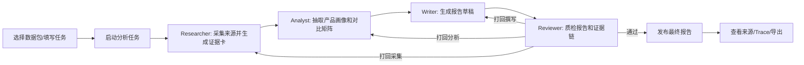
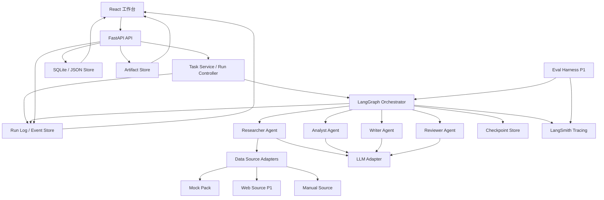
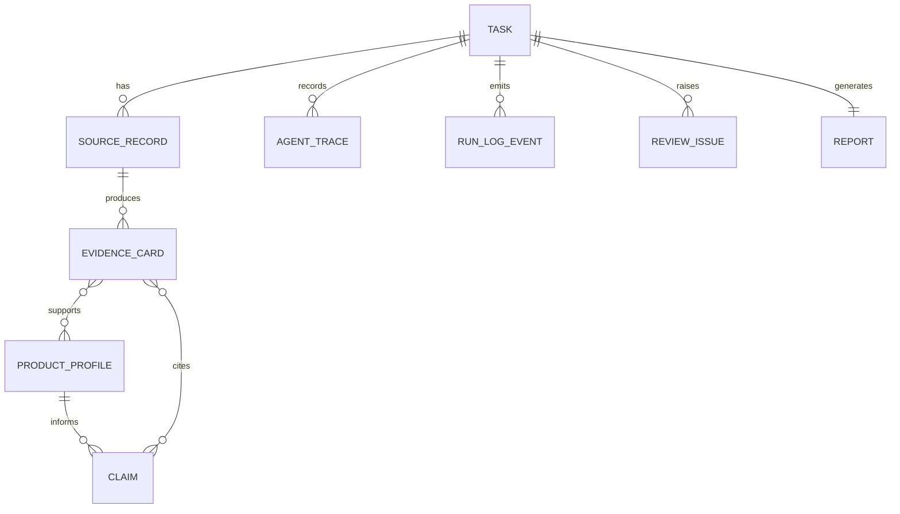

# Scout PRD - AI 驱动的可审计竞品分析 Agent 协作系统

**版本**: v4.0  
**日期**: 2026-05-28  
**状态**: MVP 设计稿  
**面向赛事**: 字节 CIS AI 全栈项目挑战赛  
**交付窗口**: 7 天完成可演示 MVP，6 月 10 日前完成打磨、录屏与答辩材料  

---

## 1. 产品概述

Scout 是一个面向企业产品团队的竞品分析 Agent 协作系统。用户输入一个行业方向、主品、竞品列表和分析目标后，系统通过多个专职 Agent 自动完成信息采集、知识结构化、竞品对比、SWOT、报告生成和质检复核，并在前端工作台展示完整 DAG、Agent Trace、证据来源和 Reviewer 打回过程。

本产品的核心不是“生成一份竞品报告”，而是把企业竞品分析流程做成一个可审计、可追溯、可复核、可扩展的 Agent 工作台。

### 1.1 一句话定位

Scout = 会自己调研、会自我质检、能展示证据链和执行轨迹的竞品分析数字调研小组。

### 1.2 核心价值

| 价值 | 说明 |
|---|---|
| 效率提升 | 将人工数小时到数天的竞品资料整理压缩为分钟级 Demo 流程 |
| 可信输出 | 每条关键结论绑定来源、证据卡和置信度 |
| 过程可见 | LangGraph DAG、LangSmith Trace、节点输入输出和 Token 消耗可查看 |
| 真实闭环 | Reviewer Agent 能识别缺来源、Schema 缺失、低置信度等问题并打回重做 |
| 可扩展 | 行业、竞品对象、Schema Pack 和数据包可替换 |

---

## 2. 背景与问题

企业产品团队进行竞品分析时，常见流程包括信息搜集、功能对比、用户评价整理、SWOT 分析和结构化报告输出。当前流程有四类痛点：

1. **信息源分散**: 官网、文档、新闻、评测、用户评论和访谈记录分散在不同位置。
2. **结构不一致**: 不同研究人员输出的功能树、定价模型、用户画像口径不一。
3. **结论难复核**: 报告中的判断经常缺少来源，评审者难以确认依据。
4. **协作过程不可见**: Agent 是否真的分工协作、是否自我校验，单看最终报告无法判断。

比赛评分重点要求多 Agent 编排、结构化消息、DAG 可视化、信息溯源、可观测和反馈闭环。因此 Scout 必须把“分析过程”本身产品化，而不是只追求报告文案漂亮。

---

## 3. 目标与非目标

### 3.1 产品目标

| 编号 | 目标 | 成功标准 |
|---|---|---|
| G1 | 完成端到端竞品分析链路 | 从创建任务到最终报告，本地 Demo 可稳定跑通 |
| G2 | 体现真实多 Agent 协作 | 至少 4 类 Agent 节点，状态通过结构化 Schema 传递 |
| G3 | 体现可信度和溯源 | 关键 Claim 引用覆盖率 >= 90% |
| G4 | 体现真实反馈闭环 | Reviewer 至少触发一次打回，重跑后 Issue 状态改善 |
| G5 | 体现工程完整度 | LangGraph 编排 + LangSmith Trace + 前端工作台 + 文档齐全 |
| G6 | 体现业务可扩展性 | 至少支持 1 个主数据包和 1 个可扩展示例数据包 |

### 3.2 非目标

| 非目标 | 原因 |
|---|---|
| 不做通用互联网爬虫平台 | 一周内高风险，且比赛重点不是爬虫规模 |
| 不做生产级账号/权限/计费系统 | 与评分主线无关 |
| 不做复杂多租户并发调度 | 并发是 Nice to have，非强制 |
| 不做大而全行业数据库 | 先证明 Agent 协作、溯源和闭环 |
| 不依赖现场实时联网成功 | 现场演示优先稳定，联网作为加分项 |

---

## 4. 用户与使用场景

### 4.1 目标用户

| 用户 | 典型问题 | 产品能力 |
|---|---|---|
| 产品经理 | 竞品有哪些关键差异？机会点是什么？ | 竞品矩阵、SWOT、用户画像、建议优先级 |
| 战略/行业研究人员 | 结论依据在哪里？是否可信？ | Claim 溯源、证据卡、来源列表、置信度 |
| 评委/导师 | 是否真的做了多 Agent 协作？ | DAG、Trace、Reviewer 打回、执行回放 |
| 开发者/维护者 | Agent 出错在哪里？如何复现？ | LangSmith Trace、节点日志、状态快照、重试记录 |

### 4.2 MVP 主演示场景

**场景名称**: 通用 AI Agent 产品竞品分析  
**用户输入**:

```yaml
industry: 通用 AI Agent
region: 全球 + 中国
main_product: 待分析主品（例如 Manus、Genspark 或某自研 AI Agent）
competitors:
  - ChatGPT
  - Claude
  - Gemini
  - Genspark
  - Manus
analysis_goal: 判断 AI Agent 产品能力差异、目标用户、机会点和风险
data_mode: mock_first
```

选择该场景的原因：

- 与开题材料 QA 中“通用 AI Agent 竞品分析”示例一致，评委理解成本低。
- 公开材料丰富，适合构造有来源的证据卡。
- 能体现 Agent 产品自身的行业理解，贴合 AI 全栈主题。

### 4.3 扩展示例场景

**场景名称**: AI 耳机 / ola friend 垂直竞品分析  
**目的**: 证明 Scout 不绑定单一行业，可以通过 Schema Pack 和数据包切换到硬件品类。

---

## 5. 产品范围

### 5.1 P0 MVP

| 模块 | P0 能力 |
|---|---|
| 任务配置 | 创建竞品分析任务，选择示例数据包、行业、主品、竞品 |
| Agent 编排 | 使用 LangGraph 编排 Researcher、Analyst、Writer、Reviewer |
| 数据读取 | 支持 Mock 数据包，保留 Web 采集适配接口 |
| 结构化知识 | 输出 Source、Evidence、ProductProfile、Claim、Report 等 Schema |
| Reviewer 闭环 | 识别缺来源、Schema 缺失、低置信度，并路由打回 |
| Trace 可观测 | 使用 LangSmith 记录节点执行、输入输出、Token、耗时、错误 |
| 前端工作台 | 展示任务、DAG、节点状态、Trace、来源、报告、质检结果 |
| 报告输出 | 生成结构化竞品报告，关键结论可点击查看来源 |
| 文档材料 | README、架构图、Agent 协议、合规说明、演示脚本 |

### 5.2 P1 加分项

| 模块 | P1 能力 |
|---|---|
| 人工介入 | 在 Reviewer 打回后允许人工编辑 Claim 或补充来源 |
| Web 采集 | 对少量官方页面或公开资料做实时采集演示 |
| 第二数据包 | AI 耳机数据包可完整跑通一个简版报告 |
| LangSmith Eval | 用 5-10 条固定样例跑离线评测，比较不同 Prompt 或版本 |
| 导出 | 导出 Markdown 报告和 Trace 摘要 |

### 5.3 P2 暂不做

- 登录注册。
- 团队协同编辑。
- 大规模任务队列。
- PDF 高保真排版。
- 企业内网数据接入。
- 长周期自动监控竞品变化。

---

## 6. 用户流程

### 6.1 主流程



### 6.2 评委演示流程

1. 打开 Scout 首页，选择“通用 AI Agent 产品竞品分析”数据包。
2. 点击“运行分析”，前端进入 DAG 工作台。
3. Researcher 节点完成，展示来源数量和证据卡。
4. Analyst 节点完成，展示功能树、定价模型、用户画像。
5. Writer 节点生成报告草稿。
6. Reviewer 节点发现 broken 数据包中的缺陷，打回 Researcher 或 Analyst。
7. 系统从 LangGraph checkpoint 恢复并重跑相关节点。
8. Reviewer 通过，报告页面出现最终报告。
9. 点击任一关键结论，右侧展示来源和证据卡。
10. 打开 Trace 面板，跳转或展示 LangSmith run 信息。
11. 切换到 AI 耳机数据包配置，说明系统扩展方式。

---

## 7. 功能需求

### 7.1 任务配置

| ID | 优先级 | 需求 | 验收标准 |
|---|---|---|---|
| FR-001 | P0 | 用户可以创建竞品分析任务 | 可填写行业、地区、主品、竞品、分析目标、数据模式 |
| FR-002 | P0 | 用户可以选择示例数据包 | 至少支持 `ai_agent` 和 `ai_earbuds` 配置入口 |
| FR-003 | P0 | 系统为每个任务生成唯一 Task ID | Task ID 贯穿报告、Trace、来源和日志 |
| FR-004 | P1 | 用户可以保存任务模板 | 可复用同一行业和竞品配置 |

### 7.2 Agent 编排

| ID | 优先级 | 需求 | 验收标准 |
|---|---|---|---|
| FR-101 | P0 | 系统使用 LangGraph 管理 Agent DAG | DAG 至少包含 Researcher、Analyst、Writer、Reviewer |
| FR-102 | P0 | Agent 间通过结构化 State 传递 | 节点输入输出均可通过 Pydantic Schema 校验 |
| FR-103 | P0 | 支持 Reviewer 条件路由 | Reviewer 失败时可路由回 Researcher、Analyst 或 Writer |
| FR-104 | P0 | 支持 checkpoint 和恢复 | 打回后不从零开始，保留已完成节点结果 |
| FR-105 | P1 | 支持人工中断和恢复 | 用户可在 Reviewer 失败后编辑状态并继续执行 |

### 7.3 Researcher Agent

| ID | 优先级 | 需求 | 验收标准 |
|---|---|---|---|
| FR-201 | P0 | 读取 Mock 数据源并标准化 | 生成 `SourceRecord[]` |
| FR-202 | P0 | 从来源中抽取证据卡 | 每个产品至少 2 条 EvidenceCard |
| FR-203 | P0 | 标记来源类型和可信度 | 来源包含 official/docs/review/news/manual 等类型 |
| FR-204 | P1 | 支持少量 Web 采集 | 联网失败时自动降级到 Mock，并记录原因 |
| FR-205 | P1 | 做基础脱敏 | 用户访谈或评论中的手机号、邮箱、姓名样例被替换 |

### 7.4 Analyst Agent

| ID | 优先级 | 需求 | 验收标准 |
|---|---|---|---|
| FR-301 | P0 | 抽取产品结构化画像 | 生成 `ProductProfile[]`，包含定位、功能树、定价、用户画像 |
| FR-302 | P0 | 生成竞品对比矩阵 | 至少覆盖功能、定价、目标用户、优势、短板 |
| FR-303 | P0 | 生成可溯源 Claim | 每条关键 Claim 绑定 evidence_ids |
| FR-304 | P1 | 标记冲突证据 | 同一字段多来源冲突时输出 conflict note |
| FR-305 | P1 | 支持行业 Schema Pack | AI Agent 与 AI 耳机可使用不同扩展字段 |

### 7.5 Writer Agent

| ID | 优先级 | 需求 | 验收标准 |
|---|---|---|---|
| FR-401 | P0 | 生成结构化报告草稿 | 报告包含摘要、范围、矩阵、SWOT、机会建议、来源附录 |
| FR-402 | P0 | 报告引用 Claim | 关键段落可追溯到 Claim 和 Evidence |
| FR-403 | P0 | 不输出无来源关键建议 | 无 evidence 的 Claim 不进入最终建议 |
| FR-404 | P1 | 支持 Markdown 导出 | 可下载或复制 Markdown |

### 7.6 Reviewer Agent

| ID | 优先级 | 需求 | 验收标准 |
|---|---|---|---|
| FR-501 | P0 | 校验 Schema 完整性 | Schema 错误生成 `SCHEMA_INVALID` Issue |
| FR-502 | P0 | 校验引用覆盖率 | 关键 Claim 无来源生成 `MISSING_SOURCE` Issue |
| FR-503 | P0 | 校验置信度 | 低于阈值生成 `LOW_CONFIDENCE` Issue |
| FR-504 | P0 | 校验报告完整性 | 缺少必要章节生成 `REPORT_GAP` Issue |
| FR-505 | P0 | 生成打回指令 | Issue 包含 target_agent、target_object_id、required_fix |
| FR-506 | P0 | 展示打回前后改善 | 前端能看到 Issue 从 failed 到 fixed/approved |
| FR-507 | P1 | 支持 LLM-as-judge 复核 | 对 Claim 是否被证据支持给出结构化判断 |

### 7.7 前端工作台

| ID | 优先级 | 需求 | 验收标准 |
|---|---|---|---|
| FR-601 | P0 | 展示任务运行状态 | created/running/review_failed/completed/needs_human_fix |
| FR-602 | P0 | 展示 Agent DAG | 节点状态、边、打回路径可见 |
| FR-603 | P0 | 展示 Trace 面板 | 可查看节点输入、输出、耗时、Token、错误 |
| FR-604 | P0 | 展示来源证据 | 来源、证据卡、Claim 关联可查 |
| FR-605 | P0 | 展示最终报告 | 报告章节完整，引用可点击 |
| FR-606 | P0 | 展示 Reviewer Issues | 可按严重性、类型、目标 Agent 过滤 |
| FR-607 | P1 | 支持人工修正 | 用户编辑 Claim 或补充 evidence 后继续运行 |

---

## 8. 系统设计要求

本节不是完整技术设计，但定义产品必须具备的架构能力，防止实现成只有脚本串联、缺少状态管理和可观测性的演示。

### 8.1 技术栈

| 层级 | 技术选型 | 说明 |
|---|---|---|
| 前端 | Vite + React + TypeScript | 本地工作台、DAG 可视化、报告和证据查看 |
| 前端 UI | Tailwind CSS 或轻量组件库 | 优先保证交互密度和交付速度，不做营销页 |
| DAG 可视化 | React Flow | 展示 Agent 节点状态、边、打回路径和执行回放 |
| 后端 API | Python + FastAPI | 提供任务、报告、来源、Trace、Review API |
| Agent 框架 | LangChain + LangGraph | LangChain 负责模型/工具适配，LangGraph 负责状态图编排、条件路由、checkpoint 和恢复 |
| 结构化校验 | Pydantic | 定义 Task、Source、Evidence、Claim、Review、Trace 等核心 Schema |
| 观测与评测 | LangSmith | 记录 Agent Trace、节点输入输出、错误、metadata、tags；P1 支持 Eval Dataset |
| 本地存储 | SQLite + JSON Artifact | 保存任务状态、Artifact、Trace Mirror、Demo 数据包 |
| 模型接入 | LLM Adapter | 适配 Doubao Seed 或其他兼容模型，同时提供 Mock LLM 兜底 |
| 包管理 | Python venv/uv + npm | 以后端 `requirements.txt` 或 `pyproject.toml`、前端 `package.json` 固化依赖 |

### 8.2 总体架构



### 8.3 LangGraph 编排要求

| 能力 | MVP 要求 |
|---|---|
| StateGraph | 使用统一 `ScoutState` 管理任务状态 |
| Checkpoint | 使用本地 SQLite 或内存 checkpointer；演示环境推荐 SQLite |
| Conditional Edge | Reviewer 根据 Issue 类型路由回不同 Agent |
| Retry | 单节点失败最多重试 2 次 |
| Interrupt | P1 支持人工修正后 resume |
| Streaming | 前端至少轮询节点状态；P1 支持事件流 |
| Idempotency | 节点输入相同应产生可复现结果或引用已缓存 Artifact |

### 8.4 LangSmith 可观测要求

| 能力 | MVP 要求 |
|---|---|
| Project | 使用独立项目名，如 `scout-competition-analysis` |
| Trace | 每次任务运行对应一个 trace/thread |
| Run Metadata | 写入 task_id、agent_name、node_name、schema_pack、data_mode |
| Tags | 标记 `demo`、`mock-first`、`review-loop`、`ai-agent-pack` |
| Error Capture | LLM 错误、Schema 错误、Reviewer 打回都要可查 |
| Trace Link | 前端 Trace 面板保存 LangSmith run/trace URL 或本地 trace id |
| Eval Dataset | P1 建立 5-10 条固定样例，用于 Prompt 和 Reviewer 质量评测 |
| Redaction | 不把 API Key、原始敏感访谈内容写入 Trace |

### 8.5 存储要求

| 数据 | 存储方式 | 说明 |
|---|---|---|
| Task | SQLite | 任务配置和状态 |
| Artifact | JSON 文件或 SQLite JSON 字段 | Source、Evidence、Profile、Report |
| Checkpoint | SQLite checkpointer | 支持打回恢复 |
| Trace Mirror | SQLite/JSON | 保存 LangSmith 外的最小可展示 trace，防止现场网络不可用 |
| Data Pack | Git 管理的 JSON/YAML | Demo 稳定复现 |

### 8.6 LLM Adapter 要求

系统必须通过统一 Adapter 调模型，避免 Agent 代码直接依赖某一个供应商：

```python
class LLMAdapter:
    def generate_structured(
        self,
        prompt_name: str,
        inputs: dict,
        output_schema: type[BaseModel],
        metadata: dict,
    ) -> BaseModel:
        ...
```

MVP 支持：

- Doubao Seed 或可用兼容模型。
- Mock LLM，用于无网络/无 Key 时稳定演示。
- 结构化输出校验失败后自动重试一次。

### 8.7 运行日志与事件机制

开发 Agent 必须实现一套轻量但结构化的运行日志，便于断网、失败、回退和答辩复盘。日志不替代 LangSmith；它是本地兜底和前端展示的数据源。

| 日志对象 | 写入位置 | 用途 |
|---|---|---|
| Run Event | SQLite `run_events` + `runtime/logs/{task_id}.jsonl` | 前端运行日志、失败定位、演示复盘 |
| Agent Trace Mirror | SQLite/JSON Artifact | LangSmith 不可用时展示节点输入输出 |
| Artifact Manifest | `runtime/artifacts/{task_id}/manifest.json` | 记录每次运行产物、版本、来源 |
| Run Summary | `runtime/runs/{task_id}/summary.md` | 录屏和答辩时快速解释本次运行结果 |
| AI Coding Log | `docs/ai_coding_log.md` | 记录开发过程中的 AI 协作、关键 Prompt、采纳/拒绝原因 |

运行事件统一使用 JSON Lines，每一行是一条事件：

```json
{
  "event_id": "evt_001",
  "task_id": "task_demo_001",
  "run_id": "run_20260528_001",
  "level": "INFO",
  "event_type": "NODE_STARTED",
  "node_name": "researcher",
  "agent_name": "ResearcherAgent",
  "message": "Researcher started reading ai_agent data pack",
  "payload": {"data_mode": "mock", "schema_pack": "ai_agent"},
  "artifact_refs": [],
  "trace_id": "ls_trace_or_local_trace_id",
  "checkpoint_id": "checkpoint_002",
  "git_branch": "feature/langgraph-orchestrator",
  "git_commit": "optional_short_sha",
  "created_at": "2026-05-28T10:30:00+08:00"
}
```

必须覆盖的事件类型：

| 类型 | 触发时机 |
|---|---|
| `TASK_CREATED` | 创建任务 |
| `RUN_STARTED` / `RUN_COMPLETED` / `RUN_FAILED` | 一次运行开始、成功、失败 |
| `NODE_STARTED` / `NODE_SUCCEEDED` / `NODE_FAILED` | Agent 节点生命周期 |
| `RETRY_SCHEDULED` | 节点失败后准备重试 |
| `FALLBACK_USED` | 使用 Mock LLM、Mock 数据包或本地 Trace Mirror |
| `ARTIFACT_SAVED` | Source、Evidence、Claim、Report 等产物保存 |
| `REVIEW_FAILED` / `REVIEW_FIXED` / `REVIEW_APPROVED` | Reviewer 质量门结果变化 |
| `CHECKPOINT_CREATED` / `RESUMED_FROM_CHECKPOINT` | LangGraph checkpoint 与恢复 |
| `HUMAN_EDIT_APPLIED` | P1 人工修正 |
| `GIT_CONTEXT_CAPTURED` | 记录运行时 branch/commit |

日志写入规则：

- 每个 API 请求必须有 `request_id`，每个任务必须有 `task_id`，每次运行必须有 `run_id`。
- 每个 Agent 节点开始、结束、失败都要写 Run Event。
- 写日志失败不能阻塞主流程，但必须在控制台输出降级警告。
- 日志 payload 不允许写 API Key、邮箱、手机号、未脱敏访谈原文。
- LangSmith 可用时，Run Event 的 `trace_id` 应能关联 LangSmith trace；不可用时使用本地 trace id。

### 8.8 断网、失败、回退与恢复策略

| 场景 | 系统行为 | 日志要求 | 用户可见状态 |
|---|---|---|---|
| LangSmith 断网 | 写本地 Trace Mirror，继续运行 | `FALLBACK_USED`，payload 写 `langsmith_unavailable` | Trace 面板显示“本地 Trace” |
| Web 采集失败 | 降级到 Mock Pack 或提示该来源失败 | `NODE_FAILED` + `FALLBACK_USED` | 来源页标记采集失败原因 |
| LLM 调用失败 | 重试最多 2 次，仍失败则切 Mock LLM 或停止该节点 | `RETRY_SCHEDULED` / `RUN_FAILED` | DAG 节点变黄或红 |
| 结构化输出校验失败 | 重新提示模型输出；仍失败则生成 ReviewIssue | `NODE_FAILED`，payload 写校验错误 | Reviewer 页显示 Schema 问题 |
| Reviewer 打回 | 从 checkpoint 恢复目标节点，不重跑全部成功节点 | `RESUMED_FROM_CHECKPOINT` | DAG 展示打回路径 |
| Artifact 写入失败 | 当前 run 标记失败，不覆盖上一次成功产物 | `RUN_FAILED` | 报告页保留上一版可用报告 |
| 用户手动回退 | 回到指定 checkpoint 或上一版 report artifact | `RESUMED_FROM_CHECKPOINT` | 工作台展示回退目标 |

代码回退与运行回退分开处理：

- **运行回退**使用 LangGraph checkpoint 和 Artifact version。
- **代码回退**使用 Git revert 或新修复提交；不使用破坏性 `reset --hard` 作为常规流程。
- 每次 Demo 录屏前记录当前 `git_branch`、`git_commit` 和数据包版本，写入 Run Summary。

### 8.9 可扩展性、复用性与鲁棒性要求

| 维度 | 要求 | 验收标准 |
|---|---|---|
| 行业扩展 | 行业差异通过 Schema Pack 和 Data Pack 承载 | AI Agent 与 AI 耳机至少共享主链路，不复制一套 Agent |
| 数据源扩展 | Researcher 通过 Data Source Adapter 读取 mock/web/manual | 新增来源类型不改 Analyst/Writer 主逻辑 |
| Agent 复用 | Agent 输入输出只依赖核心 Schema | 替换 LLM 或数据包不影响 DAG 结构 |
| 失败隔离 | 单节点失败不污染已通过 Artifact | 上一次成功报告仍可查看 |
| 可观测兜底 | LangSmith 不可用时本地 Trace Mirror 可展示 | 前端 Trace 面板仍有节点输入输出 |
| 质量门 | Reviewer 规则和 LLM-as-judge 可组合 | P0 规则校验可用，P1 增强 LLM 判断 |
| 演示稳定 | Mock-first，不依赖现场外网 | 离线模式仍能完整跑通主 Demo |

### 8.10 文件结构

```text
scout/
├── backend/
│   ├── app/
│   │   ├── api/
│   │   │   ├── tasks.py
│   │   │   ├── artifacts.py
│   │   │   ├── observability.py
│   │   │   └── review.py
│   │   ├── agents/
│   │   │   ├── researcher.py
│   │   │   ├── analyst.py
│   │   │   ├── writer.py
│   │   │   └── reviewer.py
│   │   ├── core/
│   │   │   ├── graph.py
│   │   │   ├── llm_adapter.py
│   │   │   ├── langsmith.py
│   │   │   ├── logging.py
│   │   │   └── config.py
│   │   ├── models/
│   │   │   ├── task.py
│   │   │   ├── evidence.py
│   │   │   ├── report.py
│   │   │   ├── review.py
│   │   │   └── trace.py
│   │   ├── storage/
│   │   │   ├── sqlite.py
│   │   │   ├── artifacts.py
│   │   │   ├── checkpoints.py
│   │   │   └── run_events.py
│   │   └── main.py
│   ├── tests/
│   └── requirements.txt
├── frontend/
│   ├── src/
│   │   ├── api/
│   │   ├── components/
│   │   │   ├── AgentGraph.tsx
│   │   │   ├── TracePanel.tsx
│   │   │   ├── EvidencePanel.tsx
│   │   │   └── ReviewIssues.tsx
│   │   ├── pages/
│   │   │   ├── TaskCreate.tsx
│   │   │   ├── RunWorkbench.tsx
│   │   │   ├── SourcesPage.tsx
│   │   │   └── ReportPage.tsx
│   │   └── main.tsx
│   └── package.json
├── data/
│   └── packs/
│       ├── ai_agent/
│       └── ai_earbuds/
├── runtime/
│   ├── artifacts/
│   ├── logs/
│   └── runs/
├── docs/
└── README.md
```

---

## 9. 数据模型

### 9.1 核心对象关系



### 9.2 关键 Schema

#### TaskSpec

```python
class TaskSpec(BaseModel):
    task_id: str
    industry: str
    region: str
    main_product: str
    competitors: list[str]
    analysis_goal: str
    data_mode: Literal["mock", "web", "hybrid"]
    schema_pack: str
```

#### SourceRecord

```python
class SourceRecord(BaseModel):
    source_id: str
    title: str
    source_type: Literal["official", "docs", "review", "news", "interview", "survey", "manual"]
    url: str | None
    product: str | None
    captured_at: datetime
    raw_excerpt: str
    public_or_authorized: bool
```

#### EvidenceCard

```python
class EvidenceCard(BaseModel):
    evidence_id: str
    source_id: str
    product: str
    dimension: Literal["feature", "pricing", "persona", "review", "market", "risk"]
    fact: str
    normalized_value: dict[str, Any]
    confidence: float
```

#### Claim

```python
class Claim(BaseModel):
    claim_id: str
    text: str
    claim_type: Literal["fact", "comparison", "insight", "recommendation"]
    product_refs: list[str]
    evidence_ids: list[str]
    confidence: float
    reviewer_status: Literal["pending", "failed", "approved"]
```

#### ReviewIssue

```python
class ReviewIssue(BaseModel):
    issue_id: str
    severity: Literal["blocker", "major", "minor"]
    issue_type: Literal[
        "MISSING_SOURCE",
        "SCHEMA_INVALID",
        "LOW_CONFIDENCE",
        "CONTRADICTION",
        "PII_RISK",
        "REPORT_GAP",
    ]
    target_agent: Literal["researcher", "analyst", "writer"]
    target_object_id: str
    message: str
    required_fix: str
    status: Literal["open", "fixed", "accepted_risk"]
```

#### AgentTraceMirror

```python
class AgentTraceMirror(BaseModel):
    trace_id: str
    task_id: str
    langsmith_url: str | None
    agent_name: str
    node_name: str
    input_snapshot: dict[str, Any]
    output_snapshot: dict[str, Any]
    token_usage: dict[str, int]
    latency_ms: int
    status: Literal["success", "failed", "retried", "skipped"]
    error_message: str | None
```

#### RunLogEvent

```python
class RunLogEvent(BaseModel):
    event_id: str
    task_id: str
    run_id: str
    request_id: str | None = None
    level: Literal["DEBUG", "INFO", "WARN", "ERROR"]
    event_type: Literal[
        "TASK_CREATED",
        "RUN_STARTED",
        "RUN_COMPLETED",
        "RUN_FAILED",
        "NODE_STARTED",
        "NODE_SUCCEEDED",
        "NODE_FAILED",
        "RETRY_SCHEDULED",
        "FALLBACK_USED",
        "ARTIFACT_SAVED",
        "REVIEW_FAILED",
        "REVIEW_FIXED",
        "REVIEW_APPROVED",
        "CHECKPOINT_CREATED",
        "RESUMED_FROM_CHECKPOINT",
        "HUMAN_EDIT_APPLIED",
        "GIT_CONTEXT_CAPTURED",
    ]
    message: str
    node_name: str | None = None
    agent_name: str | None = None
    payload: dict[str, Any] = {}
    artifact_refs: list[str] = []
    trace_id: str | None = None
    checkpoint_id: str | None = None
    git_branch: str | None = None
    git_commit: str | None = None
    created_at: datetime
```

---

## 10. Reviewer 质量门

Reviewer 是本项目最关键的比赛亮点之一，必须做成可触发、可展示、可解释的质量门。

### 10.1 检查项

| 检查项 | 规则 | 阻断级别 |
|---|---|---|
| Schema 完整性 | 核心对象 Pydantic 校验失败 | blocker |
| 引用覆盖率 | insight/recommendation 类 Claim 无 evidence | blocker |
| 来源覆盖度 | 每个产品来源少于 2 条 | major |
| 低置信度 | Claim confidence < 0.6 | major |
| 冲突未解释 | 同字段多来源冲突但无说明 | major |
| PII 风险 | 来源或报告出现邮箱、手机号、身份证样例等 | blocker |
| 报告完整性 | 缺摘要、矩阵、SWOT、建议、附录任一核心章节 | major |

### 10.2 打回策略

| Issue 类型 | 打回节点 | 修复动作 |
|---|---|---|
| `MISSING_SOURCE` | Researcher | 补充来源或移除无证据 Claim |
| `SCHEMA_INVALID` | Analyst | 重新结构化输出 |
| `LOW_CONFIDENCE` | Researcher | 补充更多 Evidence 或降低结论强度 |
| `CONTRADICTION` | Analyst | 输出冲突解释和最终采用依据 |
| `PII_RISK` | Researcher | 脱敏后重写 Evidence |
| `REPORT_GAP` | Writer | 补齐报告章节 |

### 10.3 Demo 必备 broken case

`data/packs/ai_agent/broken/missing_pricing_source.json` 故意让某个竞品价格字段缺来源。演示时 Reviewer 应产生：

```json
{
  "issue_type": "MISSING_SOURCE",
  "severity": "blocker",
  "target_agent": "researcher",
  "required_fix": "补充 pricing 来源，或将对应 Claim 从最终报告中移除"
}
```

重跑后前端展示：

- Issue 状态从 `open` 变为 `fixed`。
- Claim 新增 evidence_ids。
- Reviewer 通过。

---

## 11. 页面与交互

### 11.1 页面结构

| 页面 | 主要内容 | P0/P1 |
|---|---|---|
| 首页 / 任务创建 | 数据包选择、任务表单、运行按钮 | P0 |
| 运行工作台 | DAG、节点状态、运行日志、当前质量指标 | P0 |
| Trace 面板 | 节点输入、输出、Token、耗时、错误、LangSmith 链接 | P0 |
| 来源证据页 | SourceRecord、EvidenceCard、Claim 关联 | P0 |
| 质检页 | Reviewer Issues、打回路径、前后差异 | P0 |
| 报告页 | 摘要、矩阵、SWOT、机会建议、来源附录 | P0 |
| 人工修正页 | 编辑 Claim、补充来源、继续执行 | P1 |

### 11.2 交互细节

- 点击 DAG 节点，右侧打开 Trace 面板。
- 点击报告引用编号，跳转到证据卡。
- 点击 Reviewer Issue，展示触发规则、目标对象和修复结果。
- 运行中每个节点显示状态：pending/running/success/failed/retried/skipped。
- 当 LangSmith 不可访问时，前端展示本地 Trace Mirror。

### 11.3 报告结构

1. Executive Summary
2. 分析范围和数据来源说明
3. 竞品功能树
4. 定价模型对比
5. 用户画像与使用场景
6. SWOT 分析
7. 机会点和风险排序
8. Reviewer 质量摘要
9. 来源附录
10. Trace 摘要

---

## 12. API 需求

### 12.1 Task API

```typescript
POST /api/tasks
GET /api/tasks
GET /api/tasks/{taskId}
POST /api/tasks/{taskId}/run
POST /api/tasks/{taskId}/resume
```

### 12.2 Artifact API

```typescript
GET /api/tasks/{taskId}/sources
GET /api/tasks/{taskId}/evidence
GET /api/tasks/{taskId}/claims
GET /api/tasks/{taskId}/report
GET /api/tasks/{taskId}/review
```

### 12.3 Observability API

```typescript
GET /api/tasks/{taskId}/graph
GET /api/tasks/{taskId}/events
GET /api/tasks/{taskId}/traces
GET /api/tasks/{taskId}/traces/{traceId}
GET /api/tasks/{taskId}/summary
```

### 12.4 Human Fix API P1

```typescript
PATCH /api/tasks/{taskId}/claims/{claimId}
POST /api/tasks/{taskId}/evidence
POST /api/tasks/{taskId}/review/accept-risk
```

---

## 13. 指标与验收

### 13.1 产品指标

| 指标 | 目标 |
|---|---|
| Mock 模式端到端运行时间 | <= 3 分钟 |
| 关键 Claim 引用覆盖率 | >= 90% |
| 每个产品来源数量 | >= 2 |
| Schema 校验通过率 | 100% |
| Reviewer 打回改善率 | >= 80% |
| Demo 连续运行稳定性 | 连续 3 次无崩溃 |
| Run Event 覆盖率 | 每个 P0 节点至少有 started/succeeded 或 failed 事件 |
| 断网降级可用性 | LangSmith 不可用时仍可展示本地 Trace Mirror |

### 13.2 比赛验收

| 验收项 | 标准 |
|---|---|
| 多 Agent 协作 | 前端能看到 DAG 和节点状态 |
| 结构化通信 | 节点输入输出是 Schema 对象，不是纯文本拼接 |
| 真实闭环 | broken case 能触发打回，并展示修复后通过 |
| 信息溯源 | 报告关键结论能点回 Evidence 和 Source |
| 可观测性 | LangSmith 或本地 Trace 能看到 Prompt/输入/输出/耗时/Token |
| 日志机制 | Run Event 能解释成功、失败、重试、降级、回退 |
| 工程完整度 | 后端、前端、存储、文档、演示脚本齐全 |
| 可扩展性 | 至少有第二数据包或 Schema Pack 示例 |
| 鲁棒性 | LLM/Web/LangSmith 任一外部依赖失败时有明确降级或失败状态 |

---

## 14. 合规与安全

| 要求 | 说明 |
|---|---|
| 密钥安全 | `.env` 不入库，文档只写配置方式 |
| 数据来源 | Mock 数据记录来源类型；Web 来源只采公开页面 |
| robots/条款 | P1 Web 采集前记录目标站点公开访问说明 |
| 脱敏 | 访谈/评论类文本进入 Trace 和报告前做 PII 清理 |
| Trace 安全 | LangSmith metadata 不写 API Key、手机号、邮箱、私人访谈原文 |
| 答辩材料 | 演示视频避免展示真实 Key 或未脱敏数据 |

---

## 15. 里程碑计划

### 15.1 第一阶段：架构骨架与数据契约

**目标**: 先把系统骨架、Schema、数据包和主链路接口定住，避免后续边做边改数据结构。

| 工作项 | 交付物 | 阶段交付标准 |
|---|---|---|
| PRD 和架构定稿 | PRD、架构图、模块边界 | 技术栈、Agent 边界、P0/P1 范围明确 |
| 项目脚手架 | `backend/`、`frontend/`、`data/`、`docs/` | 前后端能分别启动，目录结构与 PRD 一致 |
| 核心 Schema | Task、Source、Evidence、Claim、Review、Trace | Pydantic 校验通过，前后端字段命名一致 |
| API 草案 | Task、Artifact、Observability、Review API | OpenAPI 可访问，Mock response 可返回 |
| 主数据包 | `data/packs/ai_agent/` | 至少 5 个产品，每个产品不少于 2 条来源 |
| 日志骨架 | Run Event Schema、JSONL 写入、Run Summary 模板 | 能记录 TASK_CREATED 和 RUN_STARTED |

### 15.2 第二阶段：Agent 主链路与 Reviewer 闭环

**目标**: 完成真正有状态、有 Trace、有打回恢复的 LangGraph 链路，这是比赛得分核心。

| 工作项 | 交付物 | 阶段交付标准 |
|---|---|---|
| Researcher | SourceRecord、EvidenceCard | 能从 Mock 数据包生成证据卡 |
| Analyst | ProductProfile、ComparisonMatrix、Claim | 每条关键 Claim 绑定 evidence_ids |
| Writer | ReportDraft | 报告章节完整，无来源 Claim 不进入关键建议 |
| Reviewer | ReviewIssue、质量门 | broken case 能稳定触发 `MISSING_SOURCE` |
| LangGraph 编排 | StateGraph、conditional edge、checkpoint | Reviewer 失败后能路由回目标 Agent 并恢复执行 |
| LangSmith 观测 | trace/thread、metadata、tags | 每个节点可查输入、输出、耗时、Token 或本地 Trace Mirror |
| 失败恢复 | retry、fallback、checkpoint resume | LLM/Web/LangSmith 失败时能写日志并进入明确状态 |

### 15.3 第三阶段：前端工作台、演示材料与稳定性

**目标**: 把系统能力变成评委能看懂的产品体验，并准备可复现的答辩材料。

| 工作项 | 交付物 | 阶段交付标准 |
|---|---|---|
| 任务创建页 | 数据包选择、任务表单 | 可创建并启动主数据包任务 |
| 运行工作台 | DAG、节点状态、打回路径 | 能看到 Researcher -> Analyst -> Writer -> Reviewer 全流程 |
| Trace 与来源页 | Trace Panel、Evidence Panel | 报告引用能跳到 Evidence 和 Source |
| 报告页 | 结构化报告、质量摘要 | 至少 8 条关键 Claim，引用覆盖率 >= 90% |
| 演示与文档 | README、Demo Script、合规说明、录屏 | 3-5 分钟内讲清系统、闭环和得分点 |
| 稳定性检查 | Smoke Test 记录 | Mock 模式连续运行 3 次无崩溃 |
| 运行复盘 | Run Summary、事件日志样例 | 可用 task_id/run_id/git_commit 复现一次 Demo |

---

## 16. 开发流程、交付标准与 Review 规则

### 16.1 功能交付 Definition of Done

任何 P0 功能只有同时满足以下条件才算完成：

| 检查项 | 标准 |
|---|---|
| 代码完成 | 功能代码、类型定义、错误处理已提交 |
| Schema 对齐 | 后端 Pydantic Schema 与前端 TypeScript 类型一致 |
| 可观测 | 关键 Agent/API 调用有 Trace 或本地日志 |
| 可演示 | 能在本地通过固定 Demo 数据复现 |
| 验收通过 | 对应 FR 的验收标准已逐条验证 |
| 文档更新 | README、架构、Agent 协议或 Demo Script 中相关内容已更新 |

### 16.2 Review 分层

| Review 类型 | 触发条件 | 检查重点 | 通过标准 |
|---|---|---|---|
| PRD/架构 Review | 修改 PRD、Schema、Agent 边界、技术栈 | 是否影响 P0 范围和里程碑 | 无新增高风险范围，评委得分点更清晰 |
| Schema Review | 修改 `models/` 或 API response | 兼容性、字段命名、前后端一致性 | 示例数据和 Mock response 全部校验通过 |
| Agent Review | 修改 LangGraph、Agent、Prompt、Reviewer | 状态流转、打回路由、Trace、失败恢复 | broken case 仍能触发并修复 |
| 前端 Review | 修改工作台、报告、Trace、来源页 | 信息密度、可用性、引用跳转 | 演示路径 5 分钟内可顺畅完成 |
| Demo Review | 合并阶段成果前 | 端到端稳定性、录屏效果、答辩叙事 | Mock 模式连续跑 3 次无崩溃 |

### 16.3 日志、Run Summary 与 Git 搭配

开发过程和系统运行过程要能互相定位：评委看到一次 Demo 运行时，团队应能回答“这次运行用的是哪份代码、哪个分支、哪个数据包、哪条 Trace”。

| 场景 | 必做记录 |
|---|---|
| 每次启动后端 | 控制台输出当前 branch、commit、data pack 路径、LangSmith project |
| 每次创建任务 | 写 `TASK_CREATED`，记录 task config、schema_pack、data_mode |
| 每次运行任务 | 写 `RUN_STARTED`，记录 branch、commit、run_id |
| 每次节点失败 | 写 `NODE_FAILED`，记录错误类型、重试次数、checkpoint_id |
| 每次降级 | 写 `FALLBACK_USED`，说明从什么降级到什么 |
| 每次成功报告 | 写 `RUN_COMPLETED`，生成 `runtime/runs/{task_id}/summary.md` |
| 每次提交代码 | `docs/ai_coding_log.md` 记录关键 AI 协作和取舍，commit message 写清目的 |

Run Summary 最少包含：

```markdown
# Run Summary

- task_id:
- run_id:
- git_branch:
- git_commit:
- data_pack:
- schema_pack:
- langsmith_trace:
- fallback_used:
- reviewer_issues:
- final_report:
- demo_notes:
```

Git 与日志的关系：

- 运行时 `git_branch` 和 `git_commit` 写入 Run Event，方便复现。
- 阶段合并前，把最新成功 Demo 的 `task_id/run_id` 写入 PR 或 commit 说明。
- 修复失败运行时，优先新建 `fix/*` 分支，用新提交修复；不要用破坏性回滚掩盖问题。
- 如果某次失败是模型或网络导致，不改代码也要在 Run Summary 标注，避免被误判为系统 bug。

### 16.4 分支策略

当前项目应先初始化 Git 仓库，默认分支为 `main`。原则是：影响运行时行为的一律开分支；纯文档小修可以直接提交到 `main`。

| 情况 | 是否开 branch | 示例 |
|---|---|---|
| 新增 P0/P1 功能 | 必须开 | `feature/langgraph-orchestrator`、`feature/trace-panel` |
| 修改 Agent DAG、Schema、API 契约 | 必须开 | `feature/reviewer-routing`、`feature/evidence-schema` |
| 修改依赖、构建、启动命令 | 必须开 | `chore/backend-deps`、`chore/frontend-vite-config` |
| 修复影响 Demo 的 bug | 必须开，紧急时可短分支快合 | `fix/reviewer-loop` |
| 新增或大改数据包 | 建议开 | `data/ai-agent-pack` |
| 文档结构大改 | 建议开 | `docs/prd-v4`、`docs/demo-script` |
| 拼写、格式、小段文档补充 | 可直接 push main | 修 typo、补一句说明、不影响开发契约 |
| 密钥、`.env`、敏感数据 | 禁止提交 | 任何分支都不能提交真实 Key |

### 16.5 合并到 main 的标准

合并前必须完成：

1. 本地启动后端和前端无报错。
2. 相关 P0 演示路径可跑通。
3. 关键 Schema 校验通过。
4. 没有真实密钥、未脱敏访谈或无授权数据。
5. Commit message 能说明变更目的，例如 `feat: add reviewer routing loop`。
6. 若改动 Agent 或 Reviewer，必须重新跑 broken case。

### 16.6 直接 push main 的限制

只有以下情况可以直接 push `main`：

- Markdown 拼写、排版或小段说明修正。
- 不改变接口、Schema、依赖、运行逻辑的文档补充。
- 比赛材料目录下的非敏感文本说明。

直接 push 后仍需保证：

- 不提交 `.env`、API Key、真实用户隐私数据。
- 不破坏 PRD 中已有编号和表格结构。
- 如果发现改动超过 30 行或影响开发契约，应改为开 branch。

### 16.7 子 Agent 并行开发规则

只有在任务边界清晰、写入文件不重叠、Schema/API 契约已冻结时，才适合开子 Agent 并行开发。并行的目标是缩短交付时间，不是把不确定性扩散到多个方向。

| 适合并行 | 不适合并行 |
|---|---|
| 前端页面和后端 Agent 已有稳定 API 契约 | Schema 还在频繁变化 |
| 数据包整理与前端工作台开发 | 多个 Agent 同时改 `models/` |
| Reviewer 规则实现与报告页 UI | LangGraph 主状态还没定 |
| 文档/演示脚本与功能开发 | 同一个文件多人编辑 |
| 独立测试/Smoke Test 与主功能收尾 | 紧急阻塞 bug，需要主开发者直接处理 |

推荐并行拆分：

| 子 Agent | 负责范围 | 禁止修改 |
|---|---|---|
| Backend Agent | `backend/app/agents/`、`backend/app/core/graph.py` | 未经确认不改前端页面 |
| Frontend Agent | `frontend/src/pages/`、`frontend/src/components/` | 不改后端 Schema |
| Data Agent | `data/packs/`、来源整理、broken case | 不改 Agent 代码 |
| Docs Agent | `docs/`、README、Demo Script | 不改运行逻辑 |
| QA Agent | `tests/`、Smoke Test、验收记录 | 不直接改业务功能，除非明确授权 |

并行前必须写清：

1. 子 Agent 的目标。
2. 允许修改的文件范围。
3. 禁止修改的文件范围。
4. 输入契约和输出契约。
5. 需要运行的验证命令。
6. 最终回复必须列出 changed files、commands、risks、open questions。

并行合并顺序：

1. 先合 Schema/API 契约。
2. 再合后端 Agent 和存储。
3. 再合前端页面。
4. 再合数据包和文档。
5. 最后由主开发者跑端到端 Demo Review。

### 16.8 开发 Agent 接手协议

如果把本 PRD 交给开发 Agent，应要求它按以下顺序执行：

1. 先阅读 `3. 目标与非目标`、`5. 产品范围`、`7. 功能需求`、`8. 系统设计要求`、`10. Reviewer 质量门`、`15. 里程碑计划`、`16. 开发流程`。
2. 只实现 P0，除非 P0 已经通过 Smoke Test。
3. 开工前说明本次要改的模块、文件范围、分支名和验收标准。
4. 修改运行逻辑前必须开 branch。
5. 每完成一个功能，更新对应日志、文档或验收记录。
6. 不提交 `.env`、真实 Key、未脱敏数据。
7. 最终输出必须包含：改了什么、改了哪些文件、怎么验证、还有什么风险。

---

## 17. 文档交付

| 文件 | 内容 |
|---|---|
| `README.md` | 项目介绍、启动命令、Demo 步骤 |
| `docs/architecture.md` | 系统架构、LangGraph DAG、存储和降级策略 |
| `docs/agent_protocol.md` | Agent 职责、输入输出 Schema、打回协议 |
| `docs/langsmith_observability.md` | LangSmith project、tags、metadata、eval 设计 |
| `docs/run_logging.md` | Run Event、Trace Mirror、Run Summary、失败恢复和日志脱敏规则 |
| `docs/development_workflow.md` | 分支策略、Review 标准、子 Agent 并行开发规则 |
| `docs/compliance.md` | 数据来源、脱敏、密钥和 Trace 安全 |
| `docs/demo_script.md` | 5 分钟现场演示脚本 |
| `docs/scoring_alignment.md` | 逐条对齐比赛评分标准 |
| `docs/ai_coding_log.md` | AI 编程协作记录、关键 Prompt、采纳/拒绝原因 |

---

## 18. 风险与应对

| 风险 | 影响 | 应对 |
|---|---|---|
| LLM 输出不稳定 | Schema 校验失败 | 结构化输出 + Pydantic 校验 + 重试 + Mock LLM |
| LangSmith 现场网络不可用 | Trace 展示失败 | 本地 Trace Mirror 兜底 |
| Reviewer 闭环像假流程 | 高权重扣分 | broken case 固定触发，前后差异可视化 |
| Web 采集失败 | 演示中断 | Mock-first，Web 采集作为 P1 |
| 前端过度设计 | 影响交付 | 只做工作台核心页面，不做营销页 |
| 数据结论不可信 | 评分扣分 | Claim 无 Evidence 不进入最终报告 |
| 运行日志过噪 | 评委难以理解、开发难以定位 | 只记录结构化关键事件，前端默认展示摘要 |
| 日志泄露敏感信息 | 合规风险 | 写入前统一 redaction，禁止记录 Key 和原始敏感文本 |
| 并行开发冲突 | 合并延误 | 子 Agent 必须拥有不重叠写入范围，Schema/API 先冻结 |
| 时间不足 | MVP 不完整 | 先保 P0 主链路，P1 全部可砍 |

---

## 19. 最终交付物

1. 可运行代码库。
2. 本地竞品分析工作台。
3. LangGraph Agent DAG。
4. LangSmith Trace 或本地 Trace Mirror。
5. AI Agent 主演示数据包。
6. AI 耳机扩展示例数据包或 Schema Pack。
7. Reviewer 真实打回样例。
8. 可溯源结构化竞品报告。
9. Run Event 日志、Run Summary 和 Trace Mirror。
10. README、架构图、Agent 协议、合规说明、开发流程、演示脚本。
11. 3-5 分钟演示录屏。

---

## 20. MVP 完成定义

MVP 只有在以下条件全部满足时才算完成：

- 用户能创建并运行一个竞品分析任务。
- LangGraph DAG 至少执行 4 个 Agent 节点。
- 每个节点有结构化输入输出和 Trace。
- 每次运行有 Run Event 日志和 Run Summary。
- Reviewer 能打回一次，并能恢复执行。
- 最终报告至少包含 8 个关键 Claim，其中 90% 以上有来源。
- 前端能展示 DAG、Trace、来源、质检和报告。
- Demo 可在无外网采集的情况下稳定跑通。
- 文档和录屏足以让评委理解系统设计，不只看到最终文本。
