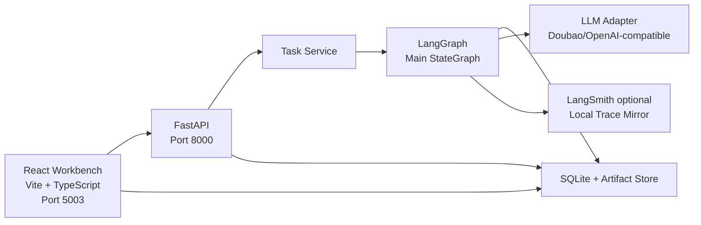
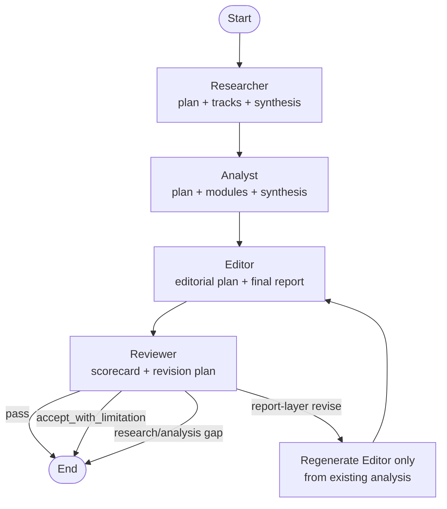
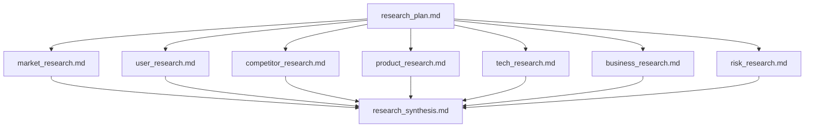
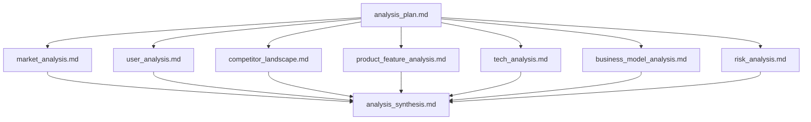

# Scout Architecture

**Version**: v2.0  
**Date**: 2026-05-28  
**Primary references**: `PRODUCT_DEFINITION.md`, `PRD_0528.md`, `SOP_0528.md`

---

## 1. Architecture Thesis

Scout is built as:

```text
AI competitive analysis workbench
+ auditable multi-agent research system
+ Markdown-first artifact tree
```

The product surface is a competitive analysis report. The system surface is an inspectable research tree.

The main flow is intentionally simple:

```text
Researcher -> Analyst -> Editor -> Reviewer
```

The depth comes from what happens inside each node:

- Researcher plans, fans out into research tracks, then synthesizes.
- Analyst plans, fans out into module analysis, then synthesizes.
- Editor builds a coherent final report from analysis modules.
- Reviewer simulates an editorial review committee and produces scorecard/revision plan.

---

## 2. Runtime Overview



---

## 3. LangGraph Main Flow



P0 rule:

- Reviewer does not automatically rerun the full chain.
- Report-layer issues may trigger Editor-only regeneration.
- Research or analysis gaps become explicit revision plans.

---

## 4. Internal Research Tree

### 4.1 Researcher



Researcher follows:

```text
Plan -> ReAct collection loop -> Evidence extraction -> Research synthesis
```

Mandatory tracks:

- `market_research.md`
- `user_research.md`
- `competitor_research.md`

Dynamic tracks:

- `product_research.md`
- `tech_research.md`
- `business_research.md`
- `design_research.md`
- `risk_research.md`

Dynamic tracks are selected by category. For AI products, tech is usually important. For fashion/consumer products, design may be important. For SaaS or platform products, business model and distribution may be important.

### 4.2 Analyst



Analyst follows:

```text
Evidence Reality Check -> Analysis Plan -> Module Articles -> Analysis Synthesis
```

Analyst does not search for new competitors. It writes analysis from Researcher artifacts and produces module-level Claim Packs.

### 4.3 Editor

Editor follows:

```text
Read analysis_synthesis -> Editorial plan -> Final report -> Editorial notes
```

Editor 是 **主编 / Report Editor-in-Chief**。它可以形成跨模块综合观点，但所有实质判断都必须追溯到 Analyst modules 和 evidence。

### 4.4 Reviewer

Reviewer is one physical LangGraph node in P0. Its prompt simulates a committee:

- Evidence Reviewer
- Product Reviewer
- Strategy Reviewer
- Editorial Reviewer
- Risk Reviewer
- Originality Reviewer

Outputs:

- `review_scorecard.md`
- `revision_plan.md`
- `index.json`

---

## 5. Artifact Storage Contract

```text
runtime/artifacts/{task_id}/
  researcher/
    research_plan.md
    tracks/
      market_research.md
      user_research.md
      competitor_research.md
      product_research.md
      tech_research.md
      business_research.md
      risk_research.md
    research_synthesis.md
    index.json

  analyst/
    analysis_plan.md
    modules/
      market_analysis.md
      user_analysis.md
      competitor_landscape.md
      product_feature_analysis.md
      tech_analysis.md
      business_model_analysis.md
      risk_analysis.md
    analysis_synthesis.md
    index.json

  editor/
    editorial_plan.md
    final_report.md
    editorial_notes.md
    index.json

  reviewer/
    review_scorecard.md
    revision_plan.md
    index.json
```

Rules:

- Markdown is the primary artifact.
- JSON indexes describe the tree and support frontend/API rendering.
- Child artifacts are retained after synthesis.
- Parallel workers never write the same Markdown file.
- Parent/orchestrator writes synthesis and index files.

---

## 6. State Model

The LangGraph state should include:

```python
class ScoutState(TypedDict, total=False):
    task_id: str
    run_id: str
    schema_pack: str
    data_pack: str
    data_mode: str

    topic: str
    main_product: str
    competitors: list[str]
    research_goal: str

    sources: list[dict]
    evidence: list[dict]
    artifact_index: dict

    research_summary: dict
    analysis_summary: dict
    final_report_ref: str | None

    reviewer_verdict: str | None
    review_issues: list[dict]
    revision_plan_ref: str | None

    current_node: str | None
    node_history: list[str]
    trace_refs: list[str]
```

State is for orchestration. Artifacts are for durable communication and human inspection.

---

## 7. API Surface

```text
POST /api/tasks
GET  /api/tasks
GET  /api/tasks/{task_id}
POST /api/tasks/{task_id}/run
POST /api/tasks/{task_id}/regenerate-report

GET  /api/tasks/{task_id}/artifacts
GET  /api/tasks/{task_id}/artifacts/{artifact_id}
GET  /api/tasks/{task_id}/report
GET  /api/tasks/{task_id}/review

GET  /api/tasks/{task_id}/events
GET  /api/tasks/{task_id}/summary
GET  /api/tasks/{task_id}/traces
```

Frontend should render:

- Final Report first.
- Research Tree second.
- Evidence/Source view.
- Review Scorecard and Revision Plan.
- Run Events and Trace.

---

## 8. Logging and Observability

Required runtime records:

- `runtime/logs/{task_id}.jsonl`
- `runtime/runs/{task_id}/summary.md`
- `runtime/artifacts/{task_id}/...`
- LangSmith trace if available, local trace mirror otherwise

Required event types:

- `TASK_CREATED`
- `RUN_STARTED`
- `NODE_STARTED`
- `PLAN_CREATED`
- `SUBTASK_STARTED`
- `SUBTASK_SUCCEEDED`
- `SUBTASK_FAILED`
- `FALLBACK_USED`
- `ARTIFACT_SAVED`
- `NODE_SUCCEEDED`
- `NODE_FAILED`
- `REVIEW_ISSUE`
- `REVIEW_DECIDED`
- `REPORT_REGENERATED`
- `RUN_COMPLETED`
- `RUN_FAILED`

Logs must never include API keys, `.env` values, or private raw data.

---

## 9. Failure and Recovery Model

| Failure | Recovery |
|---|---|
| Source/crawler failure | Use mock pack if configured, mark source gap. |
| LLM failure | Retry with bounded attempts, then fail loudly. |
| LangSmith failure | Use local trace mirror. |
| One research track fails | Preserve sibling artifacts and synthesize with explicit gap if possible. |
| Reviewer finds report issue | Regenerate Editor only from existing analysis. |
| Reviewer finds research/analysis gap | Emit revision plan; no automatic full-chain rerun in P0. |
| Artifact write failure | Fail run; do not overwrite last known good artifact. |

The system should optimize for local repair, not global restart.

---

## 10. Data Pack Strategy

P0 uses mock-first source collection:

```text
data/packs/{pack_name}/
  manifest.json
  sources.json
  mock_data.md
  broken/
```

Mock packs are not fake analysis. They replace external crawling so the demo is stable. The Researcher, Analyst, Editor, and Reviewer reasoning path should still use the configured LLM unless the run explicitly fails.

---

## 11. Extensibility

### 11.1 New Category

Add a data pack and allow Researcher planning to select dynamic tracks.

Examples:

- AI wearable fitness: market, user, competitor, product, tech, hardware, business, risk.
- Fashion product: market, user, competitor, design, distribution, brand, pricing.
- SaaS tool: market, user, competitor, feature, workflow, pricing, distribution, integration.

### 11.2 New Agent Track

Add:

1. Markdown template.
2. Index type.
3. Prompt instruction.
4. Frontend tree label.
5. Verification case.

Do not add a new physical LangGraph node unless the track has a distinct lifecycle or retry policy.

### 11.3 New LLM Provider

Provider changes should stay behind the LLM adapter. Agent prompts and artifact contracts should not depend on a provider-specific API.

---

## 12. Implementation Notes

The runtime node and prompt now use **Editor**. The Python implementation file may still be named `writer.py` as a legacy filename; treat it as the Editor node until a dedicated file rename slice is worth the churn.
